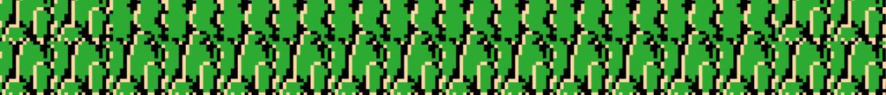
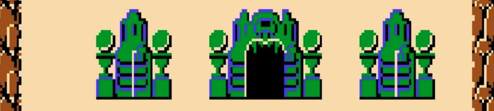
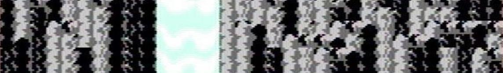
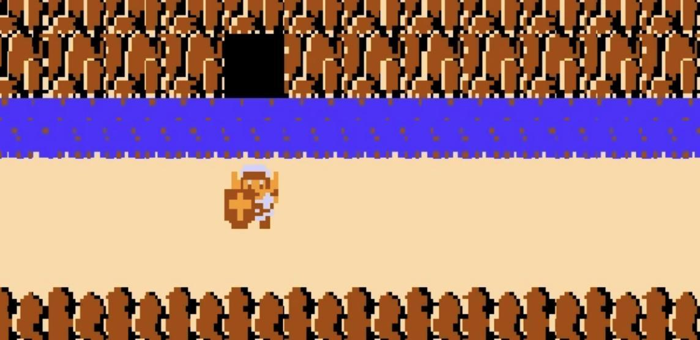
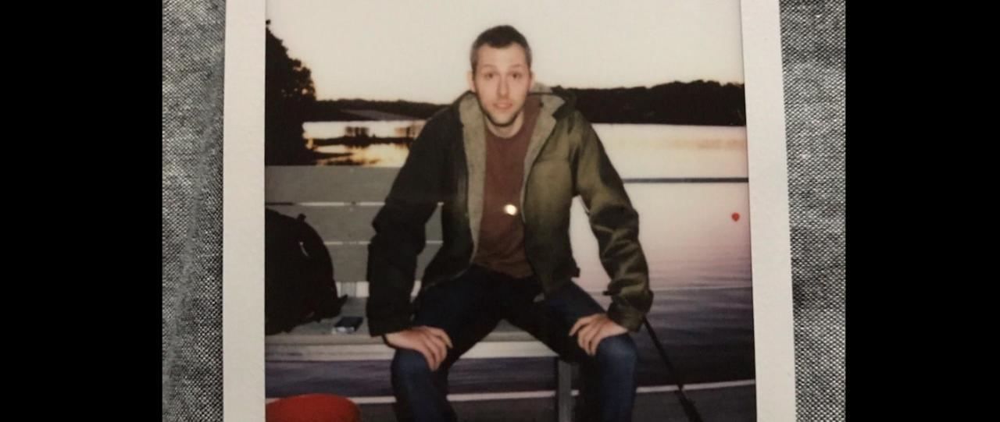

# FileZelda  
###### *By: Richard Folea*
---  
#### Video Demo: https://drive.google.com/file/d/1X0zTfmUr4IvqSYiLqrNXS6KF0cwPg4bP/view?usp=sharing
  

---  

#### Controls:
- **Movement**: W, A, S, D
- **Action**: Spacebar
- **Menu**: Esc

---  
  

---  
#### Description:

FileZelda is a simple file browser.  

The sole purpose, currently, is to allow the user to navigate their file system in a unique manner.  

At the main menu, the user is asked to select a drive from which to begin their browsing adventure.  

If the user is using Windows, the drives listed may include `C:\`, `D:\`, `E:\`, etc.  

If the user is using Linux, the drives will more likely just be the root directory `/` rather than the individual devices, unless configured otherwise.  

When a drive is selected, the user then enters the FileZelda file browser, and is able to move around as a small pixelated and nostalgic avatar.  

If the user maneuvers the player character over a directory, they may press the `Spacebar` action key to navigate into the new directory.  

The user may also use the action key (`Spacebar`) to activate the back button on the left. Activating the back button moves the user up one directory in the file structure, until reaching the root path of the initially selected drive.  

If the user chooses to browse a new or different drive, at any time they may hit the menu button `Esc`.  

In the game menu, the user has the options `Resume`, `Back to main`, and `Exit`.  

The `Resume` button exits the menu, and the user is able to pick up right back where they left off.  

The `Back to main` button exits the FileZelda file browser back to the main menu for fresh drive selection.  

The `Exit` button exits the application. To resume browsing files, the user would have to start the application back up and select a drive to begin with again.  

---  
  

---  
#### To-do:  
- Add secondary action key
- Add file info on secondary action key press while targeting item
- Add file reading, e.g. opening a file to read the contents on a scroll
- Add file manipulation - delete, move, execute
- Add loading screens
- Optimize actions, e.g. clicking menu buttons
- Add sound effects
    - Background music
    - Footsteps when moving
    - Action key pressed
    - Secondary action key pressed
    - Changing directories
    - Opening file
    - Creating file
    - Creating directory
    - Running executable
    - Deleting file
- Add animations
    - Creating file - writing scroll
    - Creating directory - shovel digging
    - Deleting file - swing sword
    - Opening file - unroll scroll
    - Extracting archive - opening chest
- Add menu options
    - Sound toggle
    - Passive mode - no file manipulation
    - Choose resolution
    - Add different generation themes, e.g. NES, N64, etc
- Add achievments
    - Furthest file depth reached
    - Amount of monsters killed
    - Files destroyed
    - Items picked up
- Add notifications
- Restructure to better match the JavaFX Game architecture
- Add FTP service
- Add RPG mode - disable file manipulation
    - Secondary action key now swings sword
    - Random monsters appear
    - Monsters can send you back to the root directory with big hits
    - Fight monsters to get new items
    - Experience gained on monster kills or when new directories explored
    - Further down the file tree the monsters get harder
    - Using the sword on files can drop different loot
    - Bigger file size means it will take more damage to break the file
- Add save/load
    - Add save and load to game menu
    - Add save and load to main menu
    - Add hotkeys for save
- Add multiplayer
    - Invite friends to your machine to conquer deeper depths of your file tree
    - Connect to a friendly machine to explore a new file tree
    - Possibly have server with more than one player capabilities
        - docker container with predetermined file tree

---  
  

---  
#### Origin:

FileZelda originated during a brainstorming session.  

I was coming up with final project ideas for the CS50 certification.  

My initial idea had to do with clipboard management shared between devices. It would have also had a web interface to manage the cloud clipboard content.  

Once the idea was mapped out, I decided against the cloud based clipboard and opted for something more reasonable and without as many moving parts.  

Still in the arena of file manipulation, I came up with FileZelda.  

Interestingly enough, FileZelda was not the first iteration name. It was originally called Zelda File Browser, which was just not good enough.  

FileZelda is a bit of a play on words, and meant to echo the FTP service, FileZilla.  

One of my closest friends has a birthay in February, right when I was starting to brainstorm project ideas. He is also a huge Legend of Zelda fan, and I believe that may have been a contributing factor to the thought process.  

---  
  

---  

#### Purpose:  

The purpose of FileZelda is to provide a unique file browsing experience.  

FileZelda is for all people tired of scrolling through folders in a standard file explorer.  

FileZelda is also for experts that may prefer using the terminal.  

The hope is that FileZelda reaches the nerd in all of us to achieve what may otherwise be mundane file browsing.  

---  
  

---  
#### About the author:  

Howdy!  

My name is Richard Folea.  

I am a software developer and ethical hacker. I enjoy tackling new challenges, and learning new ways to look at familiar problems.  

One of my favorite things to do is to debug code given to me by other people. I love jumping in the deep end and untangling entire applications.  